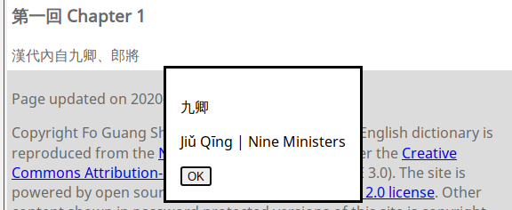

# Chinese Text Reader

A command line app for Chinese text corpus index, translation memory, and HTML
reader page generation.

Many HTML pages at chinesenotes.com and family of sites are generated from Go
templates from the lexical database and text corpus. This readme gives
instructions. It assumes that you have already cloned the project from GitHub.

The tool can create markup that can be used with JavaScript to bring up a dialog
like shown below for each term in the corpus:



The app also compiles unigram and bigram index for full text searching of the
corpus.

In addition, a translation memory is compiled from the dictionary, named
entity database, and phrase memory.

## Setup

Install the Go SDK -
[Install Documentation](https://golang.org/doc/install)

Make sure that your the go executable is on your path. You may need to do 
something like 

```shell
$ export PATH=$PATH:/usr/local/go/bin
```

## Quickstart

Download the app and the dicitonary

```shell
go get github.com/alexamies/cnreader
go run github.com/alexamies/cnreader -download_dict
```

Set an environment variable to let the app know where its home is

```shell
export CNREADER_HOME=.
```

Supply Chinese text on the command line. Observe tokenization and matching to
English equivalents

```shell
go run github.com/alexamies/cnreader -source_text="君不見黃河之水天上來"
```

Mark up a plain text file with HTML 

```shell
go run github.com/alexamies/cnreader -source_file=testdata/sampletest.txt
```

The output will be written to `output.html`.

## Basic Use

The software is contained in this project, related dictionary and corpus files
are in the hinesenotes.com project

### Build the project

Clone and build the project

```shell
https://github.com/alexamies/cnreader.git
cd cnreader
go build
```

### Get Sample dictionary and corpus file

Get the linguistic assets and add the directory `CNREADER_HOME` env variable to
your PATH

```shell
cd ..
git clone https://github.com/alexamies/chinesenotes.com.git
export CNREADER_HOME=$PWD/chinesenotes.com
cd cnreader
```

### Generate word definition files

Generate a HTML page for the defintion of each word its usage in the corpus:

```shell
./cnreader -hwfiles
```

### Analyze the corpus

Analyze the corpus, including word frequencies and writing out docs to HTML

```shell
cd $CNREADER_HOME/go/src/cnreader
./cnreader.go
```

### Markup HTML pages containing Chinese text

To mark English equivalents for all Chinese words in all files listed in
`data/corpus/html-conversions.csv`:

```shell
./cnreader -html
```

### Markup a list of file

To mark English equivalents for all Chinese words in the corpus file
`modern_articles.csv`:

```shell
./cnreader -collection modern_articles.csv
```

## Analyzing your own corpus

The cnreader program looks at the file 
$CNREADER_HOME/data/corpus/collections.csv and analyzes the lists of texts under
there. To analyze your own corpus, create a new directory tree with your own
collections.csv file and set the environment variable CNREADER_HOME to the top
of that directory.

## Go API

The API documentation is given at 

https://pkg.go.dev/github.com/alexamies/cnreader

## Testing

Run unit tests with the command

```shell
go test ./... -cover
```

Run an integration test with the command

```shell
go test -integration ./...
```